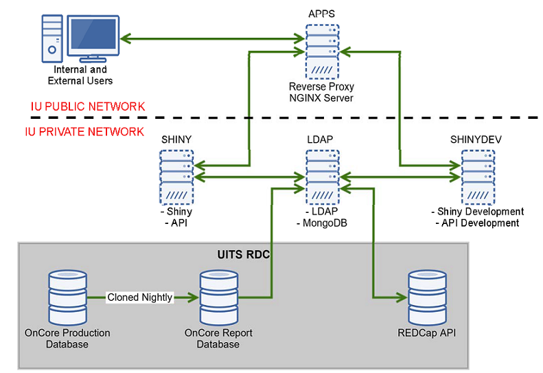
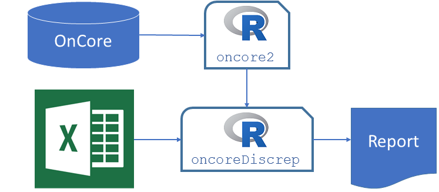
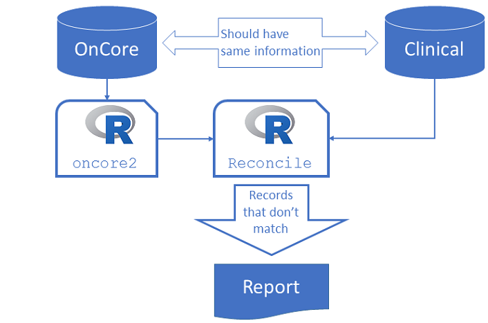
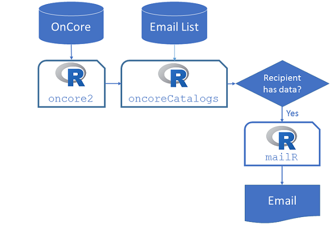
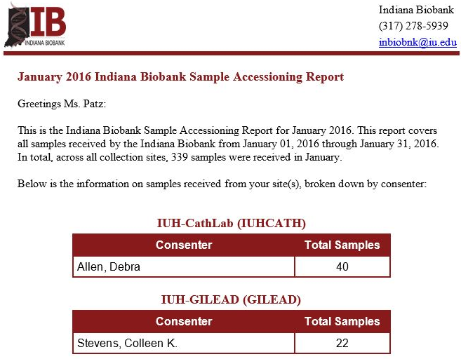

## Outline

- MMGE Overview
    + MMGE and Biobanking
    + MMGE and R/Shiny
    + Server Infrastructure
    + Application/Reporting Overview

- Applications
    + Catalogs, Dashboards, and NetAssess
    + API

- Reporting
    + Discrepancy and Reconciliation Reports
    + Automated Emails

# MMGE Overview

## MMGE and Biobanking

## MMGE and Biobanking

- We bank biological specimens for national and international research studies

- Utilize OnCore as a CTMS and biospecimen tracking system

- Utilize REDCap for online consenting and patient research registries


## MMGE and 

- R is an open source statistical programming language
    + [www.r-project.org](https://www.r-project.org/)

- We use R as a general purpose scripting language
    + Data processing
    + Text manipulation
    + Automation

- R is also an environment for data science tasks
    + Extracting data from and loading data to databases
    + Pulling data from and pushing to APIs
    

## MMGE and 

- Shiny is an R package: [shiny.rstudio.com](http://shiny.rstudio.com/)

- Makes it easy to create a web application using just the R language
    
- Apps can be developed locally on your desktop

- Live web applications require a Linux server with Shiny software installed

## Hello Shiny!

```{r eruptions, echo=FALSE}

inputPanel(
  sliderInput("bins",
                  "Number of bins:",
                  min = 1,
                  max = 50,
                  value = 30)
)

renderPlot({
  x    <- faithful[, 2]  # Old Faithful Geyser data
    bins <- seq(min(x), max(x), length.out = input$bins + 1)

    # draw the histogram with the specified number of bins
    hist(x, breaks = bins, col = 'darkgray', border = 'white')
})
```

## MMGE and Shiny

- The Shiny website has [very helpful tutorials](http://shiny.rstudio.com/tutorial/lesson1/) on how to make apps

- Check out the [gallery](http://shiny.rstudio.com/gallery) for examples of what you can do with Shiny


## MMGE Shiny Server 

- We have purchased:
      + Shiny Server Pro
      + 150 Concurrent User Pack
      + Dev License
      
- Pricing can be found here: [www.rstudio.com/pricing](https://www.rstudio.com/pricing/)

## MMGE Shiny Infrastructure



# Applications

## Specimen Catalogs

- We use Shiny to make specimen catalogs

- Allows investigators to run feasibility on basic clinical data paired with specimen availability

- Example:[LOAD study catalog](https://natebyers.shinyapps.io/dummyLOAD/) (mock data)

## REDCap Dashboard

- We can use Shiny to make dashboards

- REDCap has an API 

- We use the R package `redcapAPI` to pull data

- Example: Dashboard for PNRR

## NetAssess

- The specimen catalogs and the dashboard have been designed to be simple to use

- A good example of a more complicated Shiny application is the  [NetAssess](https://ebailey78.shinyapps.io/NetAssessApp/) app
    + Primarily developed by Eric Bailey while at the Indiana Department of Environmental Management
    + The app helps state environmental agencies assess their air pollution monitoring network
    + Full documentation can be found [here](http://ladco.github.io/NetAssessApp/)

## MMGE API

- We are developing an API for data sharing and order processing

- Technical description:
    + Written in Node.js with Express.js
    + Uses MongoDB as a database
    + Uses Mongoose.js for standardization and validation
    + Uses Passport.js with JSON Web Tokens for authentication
    
## MMGE API and R

You can use the R package `httr` to interact with the API

```{r, eval=FALSE}
x <- GET(api("orders/115/status.json"), 
         add_headers(Authorization = jwt))

y <- POST(api("orders"),
          body = list(order = upload_file("orders/order_115.xml"),
                      attachments = upload_file("orders/form.pdf")),
          add_headers(Authorization = jwt))
```

Documentation for the API can be found here: [biosend.org/api](https://biosend.org/api/)

# Reporting
    
## Reporting with `oncore2`

- We use R to create reports based on data from various databases

- We have developed an R package called `oncore2` for retrieving data from OnCore 
    + Uses a direct connection to the Oracle database for OnCore
    + Has simple R functions for retrieving data
    + No SQL is required to use the functions
    
## Reporting with `oncore2`

Example:

```{r, eval=FALSE}
library(oncore2)
query <- oncore_connect() %>%
    select_fields(SPECIMEN_NO, SPECIMEN_TYPE, 
                  SPECIMEN_QUANTITY, UNIT_OF_MEASURE) %>%
    execute_query()
```

- Currently this package is in a private repository on IU GitHub


## OnCore Discrepancy Reports

- We have developed a system for enabling our OnCore users to check discrepancies

- For situations where the report cannot be created using OnCore's reporting functionality

- Requires the OnCore user to write a simple logical statement

- Example: `[ACCESSION_DATE] < [COLLECTION_DATE]`

## OnCore Discrepancy Reports

The OnCore user creates a discrepancy check by filling out an Excel file on a shared drive



- Reports are automatically run once a week

## Reconciliation Reports

- We use R to reconcile OnCore with other databases

- Clinical study sites typically
    + Collect biological specimens from a subject
    + Enter data about the specimens into a clinical database
    + Then ship biospecimens to us

- We write scripts that will periodically compare the data in OnCore with the clinical databases

- If any records don't match up (i.e. do not reconcile), those records go into a reconciliation report

## Reconciliation Reports



## Automated Emails

We also use R to automate emails with custom reports



## Automated Emails



## MMGE and R Network Graph

```{r, echo=FALSE}
library(networkD3)
# Load data
mmge_links <- read.table(header = TRUE, text = '
source  target   value
     0       1       1
     0       2       1
     0       3       1
     0       4       3
     4       5       1
     4       6       1
')

mmge_nodes <- read.table(header = TRUE, text = '
           name  group   size
              R      R     30
  discrepancies      R     15
 reconciliation      R     15
automatedEmails      R     15
          Shiny  Shiny     25
       catalogs  Shiny     15
     dashboards  Shiny     15
')

# Plot
forceNetwork(Links = mmge_links, Nodes = mmge_nodes,
            Source = "source", Target = "target",
            #linkDistance = JS("function(d){return d.value * 0.5}"), 
            linkDistance = 100,
            NodeID = "name",
            Group = "group", Nodesize = "size", 
            opacity = 0.8, fontSize = 30, zoom = TRUE,
            legend = TRUE, charge = -500)
```


## IUPUI R Users Group

- We are planning an R users meeting

- Not trying to compete with the [Indy useR Group Meetup](http://www.meetup.com/Indy-useR-Group/)

- Our meeting will take place during the lunch hour here in the HITS building

- The purpose is to get R users on campus into the same room, to share information and ideas

- Please send an email to nrbyers@iu.edu if you are interested in attending

## Conclusion and Future Direction

- R users group

- HIPAA alignment

- Develop updates to current applications

- Develop new applications

## Discussion

- Contact Information:
    + Chris Hobbick, chobbick@iu.edu
    + Nathan Byers, nrbyers@iu.edu
    + Eric Bailey, baileye@iu.edu
- Thanks to Peter Barker for helping us design and implement our Shiny Server infrastructure

- The source for these slides can be found on GitHub: [https://github.com/NateByers/mmgeR](https://github.com/NateByers/mmgeR)
